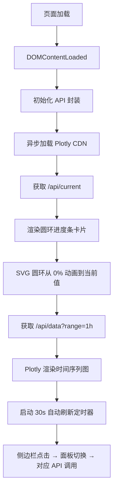

## 1. 产品概述

Digital Lab Web 仪表盘重构 — 将现有功能性的系统监控仪表盘升级为对标 iOS 设计品质的视觉体验。目标用户为单机系统管理员/开发者，用于实时监控 CPU、内存、磁盘使用率，查看进程列表、历史告警、守护进程状态等。

- 解决现有 UI 缺乏精致设计的问题
- 保持全部现有后端 API 不变
- 纯 HTML+CSS+JS 单文件，Flask 渲染输出

## 2. 核心功能

### 2.1 功能模块

1. **仪表盘**: 三个 SVG 圆环进度条（CPU/内存/磁盘）+ 实时数字卡片 + 时间趋势折线图（Plotly）
2. **进程列表**: Top 15 进程表格，奇偶行交替色
3. **告警记录**: 历史告警表格
4. **告警测试**: 触发按钮 + 结果展示
5. **守护进程**: 启动/停止/状态 三按钮
6. **历史对比**: 时间范围选择器 + 统计表格
7. **快捷启动**: 快捷方式列表 + 添加/启动
8. **生成报告**: 时间范围选择器 + 结果展示
9. **初始化/状态/配置**: 基础管理面板

### 2.2 页面详情

| 页面名称 | 模块名称 | 功能描述 |
|---------|---------|---------|
| 仪表盘 | 圆环进度条 | SVG 绘制，120px 外径，8px 线宽，圆角线帽，从 0% 动画到当前值 |
| 仪表盘 | 实时数字卡片 | 大数字 + 趋势箭头 + 迷你折线图，CSS transition 平滑过渡 |
| 仪表盘 | Plotly 图表 | 时间序列折线图，iOS 风格（无网格线、浅轴线、渐变填充） |
| 全页面 | 毛玻璃导航栏 | backdrop-filter blur，固定顶部 64px |
| 全页面 | 左侧导航 | 14 项菜单，选中高亮，蓝色透明背景 + 圆角指示 |

## 3. 核心流程

## 4. 用户界面设计

### 4.1 设计风格

- **主题**: iOS 暗色模式 (OLED 纯黑 + 毛玻璃)
- **主色**: `#000000`（背景）、`#1C1C1E`（卡片）、`#0A84FF`（强调蓝）
- **功能色**: `#30D158`（绿/正常）、`#FF9F0A`（橙/警告）、`#FF453A`（红/危险）
- **字体**: Inter（Google Fonts CDN），标题 300 字重，正文 500 字重
- **布局**: 侧边栏 + 内容区，卡片网格 gap 20px
- **按钮**: 圆角 Pill 样式，hover 上移 + 缩放

### 4.2 页面设计概览

| 页面名称 | 模块名称 | UI 元素 |
|---------|---------|---------|
| 全局 | 导航栏 | 毛玻璃 64px，Inter 34px/300 标题 |
| 全局 | 侧边栏 | 280px 宽，黑色背景，分类 + 图标 |
| 仪表盘 | 圆环卡片 | SVG 圆环 120px，中心大数字 34px/300，stagger 淡入上移 |
| 仪表盘 | Plotly 图 | 无网格线，rgba(255,255,255,0.1) 轴线，渐变填充 |
| 列表 | 进程/告警表 | 30px 行高，rgba(255,255,255,0.05) 交替行 |

### 4.3 响应式

- ≥1200px: 三列卡片 + 侧边栏展开
- 768-1200px: 两列卡片
- <768px: 单列 + 底部导航

## 5. 动效系统

- 页面加载: 卡片 stagger fadeInUp（opacity 0→1, translateY 20→0, 0.08s 间隔）
- 进度条: SVG stroke-dasharray 从 0 到目标值，1.5s cubic-bezier(0.25,0.1,0.25,1)
- Hover 卡片: translateY(-4px) scale(1.01), 0.3s ease-out
- 点击: 瞬间 scale(0.98)
- 颜色过渡: CSS transition all 0.6s cubic-bezier
- 状态指示器: 绿色 breathing 动画 2s 循环
