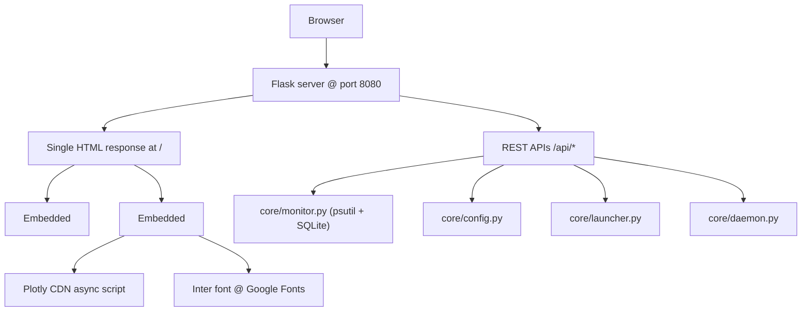

## 1. 架构设计



## 2. 技术描述

- **Frontend**: 纯 HTML5 + CSS3 + Vanilla JS（ES5 兼容），单文件嵌入 Flask 字符串
- **后端**: Flask 2.x（保持不变），Python 3.14
- **图表**: Plotly.js 2.32.0 CDN
- **字体**: Inter 400/500/600 @ Google Fonts CDN
- **无**: React/Vue/Angular/Tailwind/Bootstrap

## 3. 路由定义

| 路由 | 用途 |
|------|------|
| `GET /` | 返回完整 HTML（内嵌 CSS/JS） |
| `GET /api/current` | CPU/内存/磁盘 最新值 |
| `GET /api/data?range=1h` | 时间序列数据（1h/24h/7d/30d）|
| `GET /api/processes` | Top 15 进程列表 |
| `GET /api/alerts` | 历史告警记录 |
| `POST /api/init` | 初始化目录结构 |
| `GET /api/status` | 系统状态 |
| `GET /api/config` | 配置查看 |
| `POST /api/config` | 配置保存 |
| `POST /api/daemon/<action>` | 守护进程操作 |
| `POST /api/alert/test` | 强制触发告警 |
| `GET /api/launcher/list` | 快捷方式列表 |
| `POST /api/launcher/launch` | 启动快捷方式 |
| `POST /api/launcher/add` | 添加快捷方式 |
| `GET /api/report/generate?range=24h` | 生成分析报告 |

## 4. API 定义（保持不变）

现有 API 全部保持，无需修改。前端 JS 直接调用这些端点。

## 5. 数据模型

无需更改。SQLite `snapshots` 表结构保持 `(id, timestamp, cpu, memory, disk)`。

## 6. CSS 变量定义

```css
:root {
  --bg-primary: #000000;
  --bg-secondary: #1C1C1E;
  --bg-tertiary: #2C2C2E;
  --accent-blue: #0A84FF;
  --accent-green: #30D158;
  --accent-orange: #FF9F0A;
  --accent-red: #FF453A;
  --text-primary: #FFFFFF;
  --text-secondary: rgba(255,255,255,0.6);
  --text-tertiary: rgba(255,255,255,0.3);
}
```

## 7. 文件输出

- 修改 `core/dashboard_server.py` 中 `_CSS` 和 `_SCRIPTS` 两个变量
- 保持 `_SIDEBAR_ITEMS`, `_build_sidebar()`, `_PANEL_WRAPPER`, `index()`, 所有 API 路由不变
- 新建一个独立的 `interface/dashboard-ios.html` 文件供独立预览
